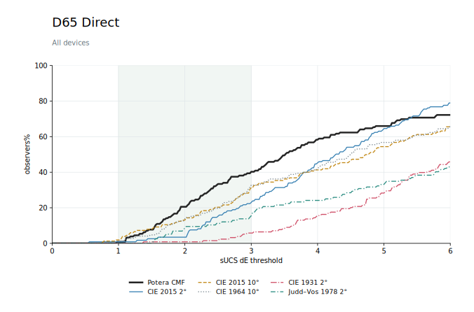
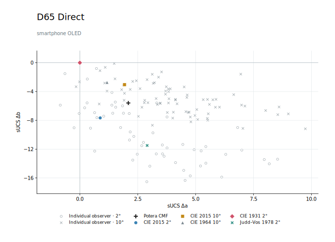
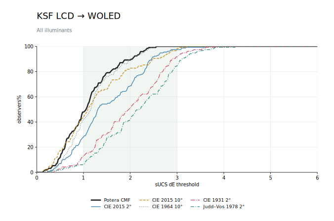

# Potera CMF

[English](README.md)

Potera CMF 是一个面向现代显示设备与真实任务设计的 CMF，包括 10° LMS cone fundamentals 与 10° cone-fundamental-based XYZs。我们通过标准的 CIE 方法构建并开源了多项 CMF 的必要数据，因此可以轻松集成至任意基于光谱的色彩科学项目中。

Potera CMF 在多项数据集的混合应用中，面对不同指标均达到了 SOTA 水平，尤其擅长在最小色差下覆盖最多的 individual observers；同时，对于 display matching 任务，较传统 CMF 有着更进一步的优势。

我们在 Benchmark 中展示了由 Dynamico 提出的 CMF 性能比较新方法。该方法有别于传统地基于 OM 或 OV 直接评估、比较数值，而是对 dE 与 individual coverage 这一单调增长关系进行趋势分析，并重点关注腰部覆盖率，对小于 JND 的部分及存在压缩的巨大长尾部分进行适当取舍。

除性能测试结果外，详细构建过程与方法将随后续公开技术报告进一步开源。

## 内容

- [`Potera_CMF/`](Potera_CMF/)：最终 CMF 数据表与图像。
- [`Potera_Benchmarks/`](Potera_Benchmarks/)：Benchmark 数据与图像。

## Benchmark 代表图

### D65 目标：全部显示设备覆盖趋势

### D65 目标：现代手机 OLED 白点

### KSF LCD → WOLED 配色：多照明体目标覆盖趋势

## 数据来源与引用

下列 CIE 官方数据集由 International Commission on Illumination（CIE）发布，采用 [CC BY-SA 4.0](https://creativecommons.org/licenses/by-sa/4.0/)：

- [CIE 1931 2° CMF](https://doi.org/10.25039/CIE.DS.xvudnb9b)
- [CIE 1964 10° CMF](https://doi.org/10.25039/CIE.DS.sqksu2n5)
- [CIE 2015 2° cone-fundamental-based XYZ](https://doi.org/10.25039/CIE.DS.548rw69q)
- [CIE 2015 10° cone-fundamental-based XYZ](https://doi.org/10.25039/CIE.DS.dm6qiig7)

Individual observer 数据与模型引用：

- [Asano、Fairchild 与 Blondé（2016），*Individual Colorimetric Observer Model*](https://doi.org/10.1371/journal.pone.0145671)
- [Stiles 与 Burch（1955）](https://doi.org/10.1080/713821039)
- [Stiles 与 Burch（1959）](https://doi.org/10.1080/713826267)
- Judd–Vos 1978 CMF 数据来自 [Colour & Vision Research Laboratory（CVRL）](http://cvrl.ioo.ucl.ac.uk/cmfs.htm)。

## 软件

数据处理与图像绘制使用了 [NumPy](https://numpy.org/)、[SciPy](https://scipy.org/)、[pandas](https://pandas.pydata.org/)、[Matplotlib](https://matplotlib.org/) 与 [colour-science](https://www.colour-science.org/)。

## 引用

在学术出版物中使用 Potera CMF、基于其产生数值结果，或将其作为 Benchmark 对比时，请引用 [`CITATION.cff`](CITATION.cff) 记录的归档数据集版本，并尽可能引用实验实际使用的具体版本。GitHub 的 “Cite this repository” 功能可生成 APA 与 BibTeX 格式。

该引用请求属于学术归属要求，独立于且不修改 Apache License 2.0 的许可与条件。
